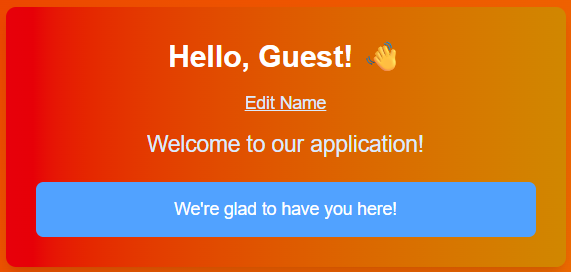
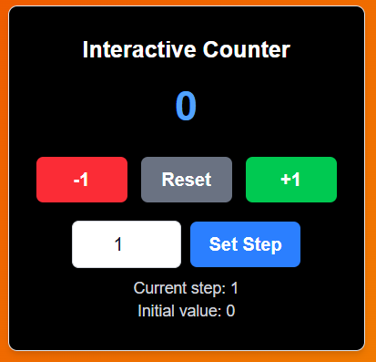
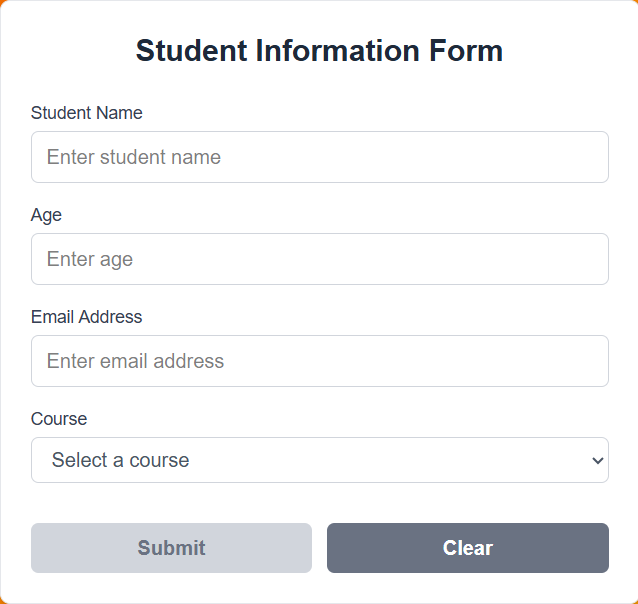
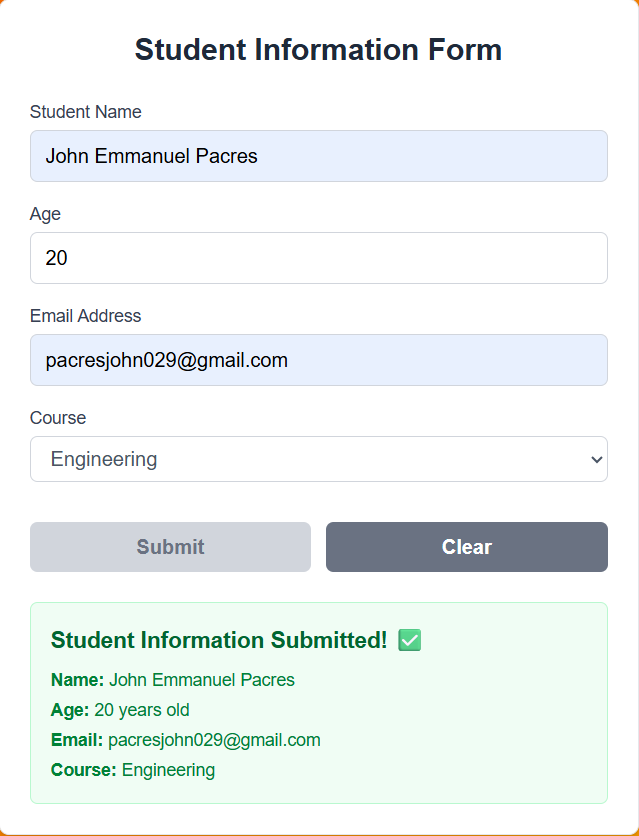

# React-NextJS-Components_Pacres
These are my first react components created within next js framework using javascript, html, and tailwind css.

## Welcome Card
A simple greeting element wherein users can customize which name they want to display in the card.

In my code, I implemented object variables to ensure that the edit name feature can be implemented:
```javascript
const handleEditClick = () => {
    setIsEditing(true);
    setTempName(name);
};

const handleSaveClick = () => {
    const newName = tempName.trim();
    setName(newName);
    setIsEditing(false);
    if (onNameChange) {
      onNameChange(newName);
    }
};

const handleCancelClick = () => {
    setIsEditing(false);
};

const handleNameChange = (e) => {
    setTempName(e.target.value);
};
```

Through props, it is  easier to adjust which message to display. Here, I initialized a greeting, message, and initialName variable as props:

```javascript
const WelcomeCard = ({ 
  initialName, //initialName props
  message, //message props
  className,
  greeting, //greeting props
  showEditButton = true, 
  onNameChange 
})
```

Implementing them in the page.jsx, looks like this:
```html
<WelcomeCard 
  initialName="Guest"
  greeting="Hello"
  message="Welcome to our application!" 
/>
```

It's output will then look like this:


Moreover, this is a snippet implementation of my welcome card in my page.js with a DOM structure of section -> division (div) -> header (h2) -> paragraph (p):

```html
<section>
    <div className="text-center mb-6">
        <h2 className="text-2xl font-semibold text-gray-700 mb-2">
            1. WelcomeCard Component
        </h2>
        <p className="text-gray-600">
            Displays welcome message with customizable props
        </p>
    </div>
    <WelcomeCard
        initialName="Guest"
        greeting="Hello"
        message="We're glad to have you here!" 
    />
</section>            
```
Here is a sample output of the counter:


## Counter
It is a basic yet interactive react component where users may increment or decrement the counter value based on the steps the user inputs.

It applies basic event handling concept. Here is a sample snippet:
```javascript
import React, { useState } from 'react';

const Counter = ({ 
  initialValue = 0, 
  step: defaultStep = 1 
}) => {
  const [count, setCount] = useState(initialValue);
  const [customStep, setCustomStep] = useState(defaultStep);
  const [inputStep, setInputStep] = useState(defaultStep.toString());

  const increment = () => {
    setCount(prev => prev + customStep);
  };

  const decrement = () => {
    setCount(prev => prev - customStep);
  };

  const reset = () => {
    setCount(initialValue);
  };

  const handleStepChange = (e) => {
    setInputStep(e.target.value);
  };

  const applyCustomStep = () => {
    const newStep = parseFloat(inputStep);
    if (!isNaN(newStep)) {
      setCustomStep(newStep);
    }
  };
```
By importing the useState function from the react library, I can implement constant/object variables that can be used to create the functions for incrementing, decrementing, and applying custom steps in changing the value of the counter.

In implementing the counter component to the page.js, I implemented a similar DOM structure from the welcome card:

```html
<section>
    <div className="text-center mb-6">
        <h2 className="text-2xl font-semibold text-gray-700 mb-2">
            2. Counter Component
        </h2>
            <p className="text-gray-600">
                Interactive counter with state management and custom step size
            </p>
    </div>
    <div className="grid center gap-4">
        <Counter initialValue={0} step={1} />
    </div>
</section>
```
Here is a sample output of counter:


## StudentInfo
Finally, for the student information react component, I applied array for college program choices, and event handling management for the buttons, textbox, and component interactivity (submission and reset feature).

There are several objects I implemented to display the element, these are some code snippet:

- For initial textbox initial event:
```javascipt
const [student, setStudent] = useState({
    name: '',
    age: 0,
    email: '',
    course: ''
});
```
This is to ensure that thee fields are empty, and only the placeholder is contained within it.
- For the submit button behavior:
```javascript
const handleSubmit = (e) => {
    e.preventDefault();
    setSubmitted(true);
    setTimeout(() => {
      setSubmitted(true);
      setIsSubmitting(false); 
    }, 500);
};
```
When all fields are empty or some fields is not yet inputted by the user, the submit button will be disabled; when it's all filled, the submit will be enabled. After submitting, the submit button will be disabled again to prevent unnecessary data changes.
- For handling input change:
```javascript
const handleInputChange = (e) => {
    const { name, value } = e.target;
    setStudent(prev => ({
      ...prev,
      [name]: name === 'age' ? parseInt(value) || 0 : value
    }));
};
```
This is to ensure that everytime user inputs a new data, the displayed submitted data is updated based on the user input.
- For clearing the fields:
```javascript
const handleClear = () => {
    setStudent({
      name: '',
      age: 0,
      email: '',
      course: ''
    });
```
It is to return the fields into default state.

In implementing it inside the page.js file, this is its DOM structure:
```html
<section>
  <div className="text-center mb-6">
    <h2 className="text-2xl font-semibold text-gray-700 mb-2">
      3. StudentInfo Component
    </h2>
    <p className="text-gray-600">
      Form component with controlled inputs and validation
    </p>
  </div>
  <StudentInfo />
</section>
```
Default state sample output:


After submission:



